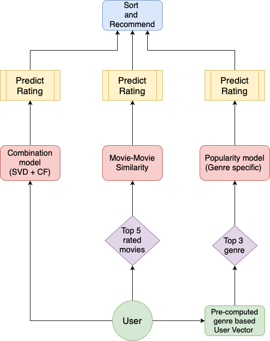

# Movie Recommendation System

**Author:** Aarthi Honguthi

A comprehensive machine learning project that builds and compares multiple recommendation algorithms to provide personalized movie suggestions. This system integrates user preferences with movie characteristics to deliver accurate and diverse recommendations.

## 🎯 Project Overview

This project aims to develop a robust movie recommendation system by combining collaborative filtering, content-based filtering, and hybrid approaches. It addresses the cold-start problem and evaluates models using industry-standard metrics to determine the most effective recommendation strategies.

## ✨ Features

- **Multiple Recommendation Algorithms**: Implements 6 different recommendation models
- **Comprehensive Evaluation**: Uses RMSE, MAE, precision, recall, F-measure, and NDCG metrics
- **Cold-Start Analysis**: Special focus on users with limited interaction history
- **Hyperparameter Tuning**: Systematic optimization of model parameters
- **Hybrid Approach**: Combines strengths of different models for improved performance
- **Interactive Notebooks**: Jupyter notebooks for step-by-step analysis and experimentation

## 📊 Datasets Used

1. **[MovieLens](https://grouplens.org/datasets/movielens/)**: User-movie ratings dataset containing:
   - User ratings (scale 0.5-5.0)
   - Movie metadata (titles, genres, release years)
   - User-generated tags

2. **[The Movie Database (TMDB)](https://www.kaggle.com/tmdb/tmdb-movie-metadata)**: Additional movie information including:
   - Popularity scores
   - Average ratings
   - Voter counts
   - Genre classifications

## 🤖 Models Implemented

### 1. Popularity Model

Recommends movies based on overall popularity and ratings within specific genres using TMDB data.

### 2. Content-Based Model

Creates user and movie profiles based on:

- Movie genres
- Release years
- Average ratings
- User preference vectors

### 3. Collaborative Filtering

- **User-User CF**: Finds similar users and recommends movies they liked
- **Item-Item CF**: Recommends movies similar to user's previously liked items
- **KNN Similarity**: Uses k-nearest neighbors with cosine and Pearson correlation metrics

### 4. Latent Factor Model (SVD)

Matrix factorization approach that discovers latent factors representing user preferences and movie characteristics.

### 5. Combined Linear Model

Weighted combination of multiple Surprise library models for improved prediction accuracy.

### 6. Hybrid Model

Integrates content-based, collaborative filtering, and SVD approaches to overcome individual model limitations and improve recommendation diversity.

## 🛠️ Technologies Used

- **Python 3.x**
- **pandas** - Data manipulation and analysis
- **scikit-learn** - Machine learning algorithms and evaluation
- **[Surprise](http://surpriselib.com/)** - Specialized recommender systems library
- **NumPy** - Numerical computing
- **Jupyter Notebook** - Interactive development and analysis
- **Matplotlib/Seaborn** - Data visualization

## 📁 Project Structure

```
MovieRecommendationSystem/
├── README.md
├── LICENSE
├── requirements.txt
├── .gitignore
├── Code/
│   ├── preprocessing.ipynb          # Data preparation and train/test split
│   ├── popularity_model.ipynb       # Popularity-based recommendations
│   ├── content_based_recommendation.ipynb
│   ├── movie_similarity_based_recs.ipynb
│   ├── movie_era_based_recs.ipynb
│   ├── movie_year_analysis.ipynb
│   ├── knn_analysis.ipynb           # KNN collaborative filtering analysis
│   ├── surprise_model_predictions.ipynb
│   ├── surprise_model_recs.ipynb
│   ├── combined_model.ipynb         # Linear combination of models
│   ├── hybrid_model.ipynb           # Advanced hybrid approach
│   ├── model_hyperparameter_tuning.ipynb
│   ├── cold_start_analysis.ipynb    # Cold-start problem analysis
│   ├── evaluating_recs.py           # Evaluation metrics implementation
│   ├── generating_predictions.py    # Prediction utilities
│   └── test_ndcg.py                 # NDCG evaluation
└── Results/
    ├── algo_results.csv             # Model performance results
    ├── README.md
    └── images/                      # Analysis visualizations
```

## 🚀 Installation & Setup

1. **Clone the repository:**

   ```bash
   git clone https://github.com/your-username/movie-recommendation-system.git
   cd movie-recommendation-system
   ```

2. **Install dependencies:**

   ```bash
   pip install -r requirements.txt
   ```

3. **Download datasets:**
   - Download MovieLens small dataset from [GroupLens](https://grouplens.org/datasets/movielens/)
   - Download TMDB dataset from [Kaggle](https://www.kaggle.com/tmdb/tmdb-movie-metadata)
   - Place datasets in appropriate directories as referenced in the notebooks

## 📖 Usage

1. **Data Preprocessing:**

   ```bash
   jupyter notebook Code/preprocessing.ipynb
   ```

   Run this notebook to prepare and split the data.

2. **Run Individual Models:**
   Open and execute the respective Jupyter notebooks in the `Code/` directory for each model implementation.

3. **Evaluate Results:**
   Use the evaluation scripts and notebooks to compare model performance.

4. **View Results:**
   Check the `Results/` directory for performance metrics and visualizations.

## 📈 Results & Evaluation

### Key Findings

- Hybrid models outperform individual approaches by combining complementary strengths
- Content-based methods excel in cold-start scenarios with limited user data
- SVD and collaborative filtering perform best with abundant user interaction data
- Systematic hyperparameter tuning significantly improves model accuracy

### Performance Metrics

- **Prediction Accuracy**: RMSE (Root Mean Square Error), MAE (Mean Absolute Error)
- **Recommendation Quality**: Precision@K, Recall@K, F-measure, NDCG



Detailed results and comparisons are available in `Results/algo_results.csv` and the analysis notebooks.

## 🤝 Contributing

Contributions are welcome! Please feel free to submit a Pull Request.

## 📄 License

This project is licensed under the MIT License - see the LICENSE file for details.

---

**Note**: This project was developed as part of a machine learning research initiative to explore modern recommender system techniques. For detailed analysis and methodology, refer to the individual Jupyter notebooks in the `Code/` directory.
